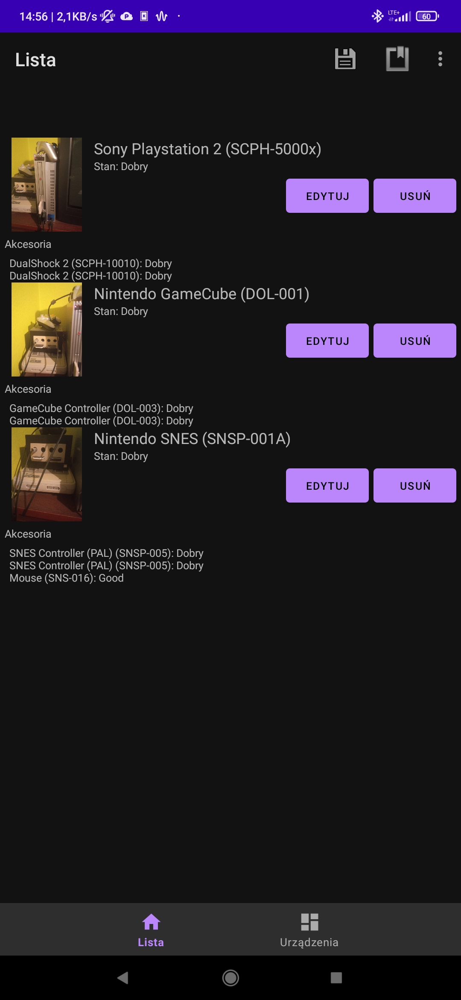
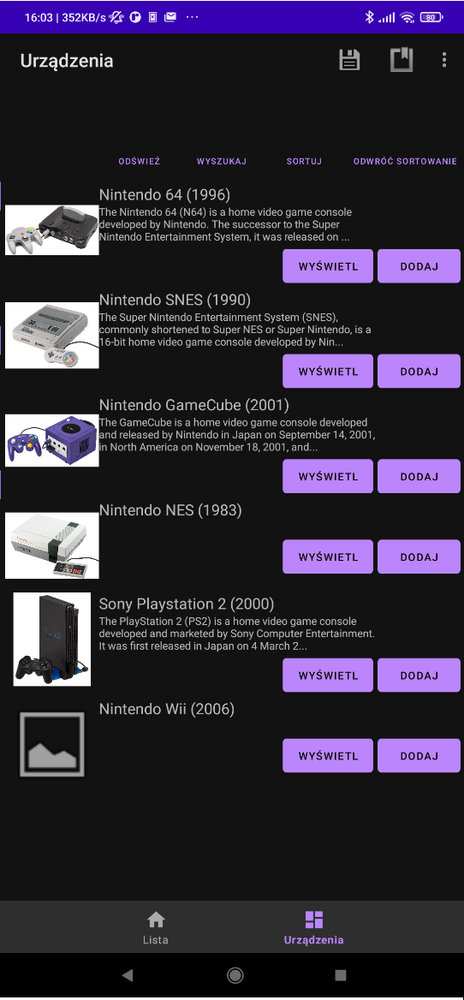

# ConsoList

A mobile app meant for tracking your game console collection. It lets you add consoles from an online database to your list, and keep track of their accessories. While browsing the database you can search for a console online on auction and marketplace sites. You can also add photos of your devices and export/import your collection to/from a file. With an administrator password, you can also add or edit consoles in the online database. The app saves the list and all the images in the internal storage of the device automatically.

Written in Kotlin using the Android SDK, and Firebase Firestore for the database.

Made for an university project.

## Screenshots

List

Database

Console View

List Entry

Database Entry Edit Panel

#
# ConsoList

Aplikacja mobilna służąca do śledzenia kolekcji konsol do gier. Pozwala na dodawanie konsol ze zdalnej bazy danych do własnej kolekcji, a także ich akcesoriów. Przeglądając bazę danych można wyszukać urządzenie na portalach aukcyjnych i ogłoszeniowych. Można również dodawać zdjęcia urządzeń i eksportować/importować kolekcję do/z pliku. Po wpisaniu hasła administratora można również dodawać lub edytować konsole w zdalnej bazie danych. Aplikacja automatycznie zapisuje listę i wszystkie zdjęcia w pamięci wewnętrznej urządzenia.

Napisana w Kotlinie przy użyciu Android SDK, i bazy danych Firebase Firestore.

Napisana na potrzeby projektu na studiach.

## Zrzuty ekranu

Lista

Baza danych

Widok konsoli

Widok urządzenia w kolekcji

Panel edycji urządzenia w bazie danych

